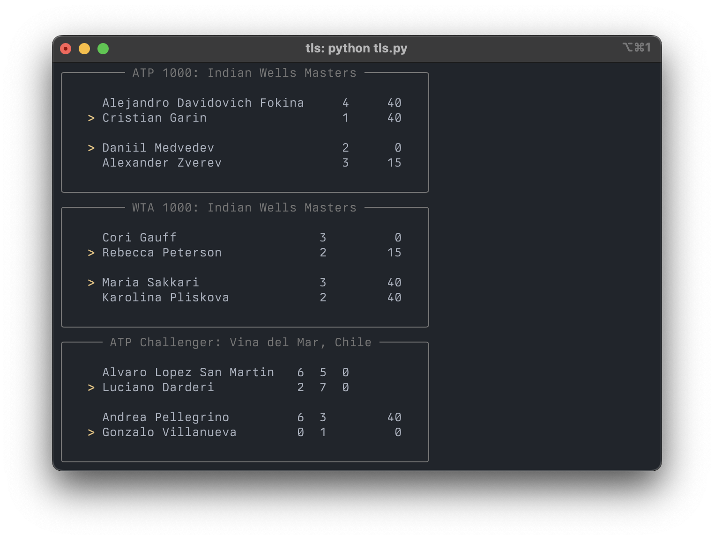

# `tls`: Tennis Live Scores

`tls` is simple tool that displays tennis (live) scores, fetched from https://www.livescores.com/tennis/live



## Requirements

This program was developed with Python 3.9.16 (see [.python-version](.python-version)).
Requirements are the following (also listed in [requirements.txt](requirements.txt)):

- [`requests`](https://requests.readthedocs.io/en/latest/) to fetch results
- [`beautifulsoup4`](https://beautiful-soup-4.readthedocs.io/en/latest/) for parsing the HTML data
- [`rich`](https://rich.readthedocs.io/en/stable/) for displaying the results

## Setup

1. Clone this repo (e.g. `gh repo clone acarril/tls`), and navigate to it
2. Install requirements (e.g. `pip install -r requirements.txt`)
3. Run with `python tls.py`; see [Usage](#usage) below

## Usage
```
python tls.py [-h] [-t {wta,atp}] [-l {gs,1000,500,250,ch}]
```

### Arguments

|short|long|default|help|
| :--- | :--- | :--- | :--- |
|`-h`|`--help`||show this help message and exit|
|`-t`|`--tour`|`None`|women's (WTA) or men's (ATP) tour|
|`-l`|`--level`|`None`|tournament level|
